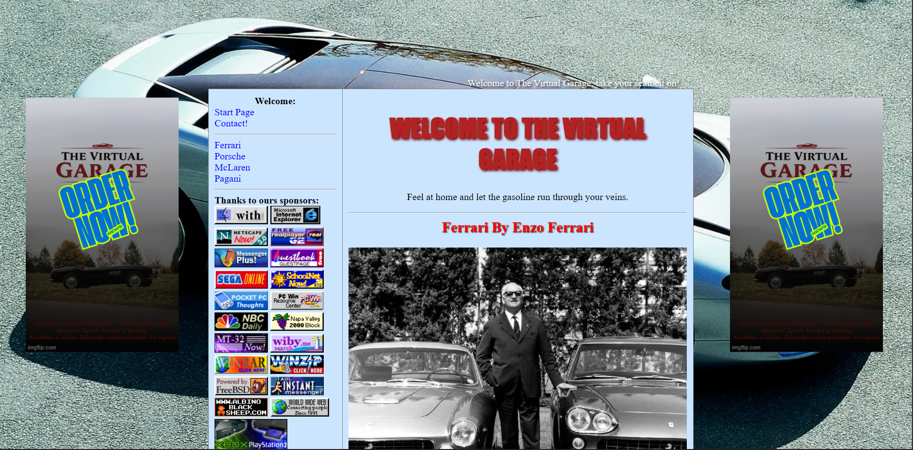
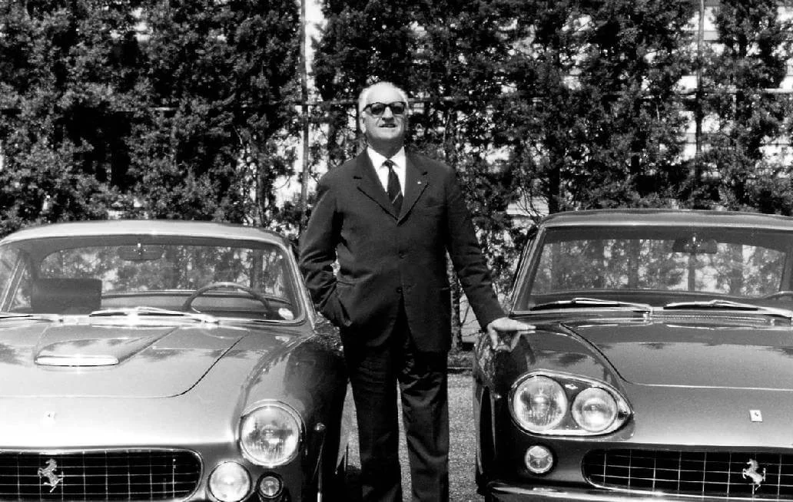
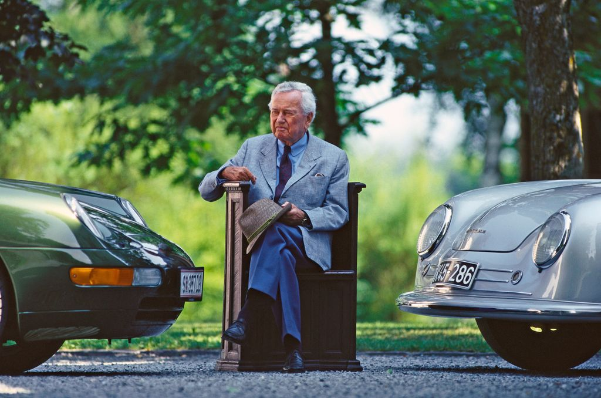
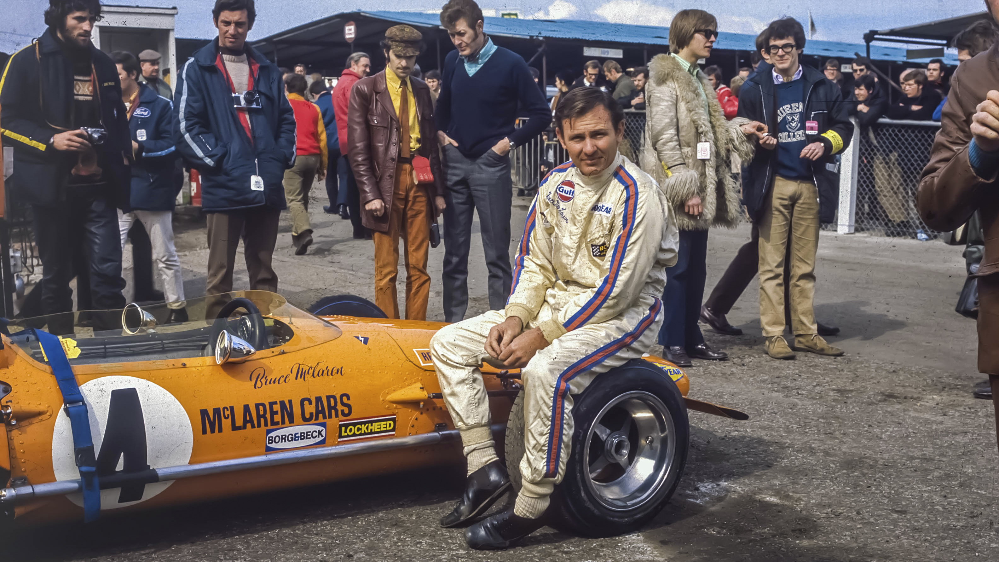
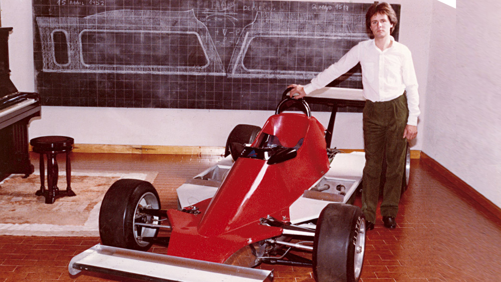

# The Virtual Garage

The Virtual Garage is a static multi-page website and my first HTML project. It was built as a retro-inspired fantasy car blog that pays tribute to the expressive design style of early 2000s fan sites, with a focus on iconic performance car brands and old-web presentation.

## Overview

This project combines a passion for cars with a nostalgic visual direction. Instead of following a modern minimalist layout, the site intentionally embraces classic web elements such as animated GIFs, marquees, bold typography, background imagery, and music to recreate the atmosphere of a vintage enthusiast website.

The site features dedicated sections for Ferrari, Porsche, McLaren, and Pagani, along with a homepage and contact page. Each section is supported by its own styling and media assets to give the project a distinct personality.

## Preview

	

	
	
	
	

## What The Project Includes

- A landing page for The Virtual Garage
- Individual pages for Ferrari, Porsche, McLaren, and Pagani
- A contact page
- Shared and page-specific CSS files
- Image galleries, retro GIFs, logos, headers, and sound assets

## Purpose

The main purpose of this project was to practice core front-end fundamentals through a complete themed website. As a first HTML project, it provided hands-on experience with:

- HTML page structure
- Navigation between multiple static pages
- CSS styling and layout customization
- Working with images, GIFs, and audio
- Building a clear visual identity for a web project

## Design Direction

The Virtual Garage is intentionally designed to feel like a car fan website from the late 1990s and early 2000s. The visual approach is nostalgic, colorful, and personality-driven, reflecting a period of the web where personal projects were more experimental and visually expressive.

## Project Structure

- `index.html` contains the homepage
- `ferrari.html`, `porsche.html`, `mclaren.html`, and `pagani.html` contain the brand pages
- `contacto.html` contains the contact page
- `css/` contains shared and page-specific stylesheets
- `images/`, `gifs/`, `headers/`, and `sounds/` contain the media assets used throughout the site

## Running The Project

This is a static HTML project, so no build process or framework setup is required.

1. Clone or download the repository.
2. Open the project folder.
3. Open `index.html` in a browser.

For a better local browsing experience, a simple static server can also be used from Visual Studio Code or any local development tool.

## Personal Note

This project marks one of my first steps into web development. It is both a learning exercise and a creative homage to retro internet culture, built around a topic I enjoy: performance and luxury cars.

## Future Improvements

- Improve the responsive layout on smaller screens
- Add more cars, brands, or historical content
- Expand the written content for each section
- Refine the presentation while preserving the retro theme
- Add more interactive elements inspired by classic web pages
